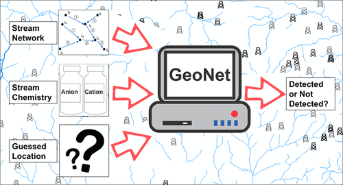

# GeoNet_2022

GeoNet analyzes stream networks to detect statistically significant
changes between background and potentially impacted sites.



## References

Assessing Contamination of Stream Networks near Shale Gas Development
Using a New Geospatial Tool Amal Agarwal, Tao Wen, Alex Chen, Anna
Yinqi Zhang, Xianzeng Niu, Xiang Zhan, Lingzhou Xue, and Susan
L. Brantley _Environmental Science & Technology_ 2020 54 (14),
8632-8639 DOI: 10.1021/acs.est.9b06761 [Link to
paper](https://pubs.acs.org/doi/10.1021/acs.est.9b06761?fig=tgr1&ref=pdf)

## Dependencies
This package was last tested on August 11, 2021. Testing environment is listed below:
| __Required Package__ | __Version__ |
|----------------------|-------------|
| R                    | 4.0.5       |
| tidyverse            | 1.3.0       |
| geoshpere            | 1.5-10      |
| network              | 1.16.1      |
| igraph               | 1.2.6       |
| mapdata              | 2.3.0       |
| intergraph           | 2.0-2       |
| sna                  | 2.6         |
| maps                 | 3.3.0       |
| GGally               | 2.1.1       |
| MASS                 | 7.3-53.1    |
| foreach              | 1.5.1       |
| doParallel           | 1.0.16      |
| data.table           | 1.14.0      |

## How to run the code:

0. Make sure all of above dependencies are installed before running the code
1. Put your data under the data folder. There are three main files required by GeoNet:
   1. Shape file for the stream network (shape.RData). 
   2. Analyte location and concentration (analyte_raw.csv)
      The analyte csv file should atleast have latitude, longitude, date and concentrations header
      Sample anaylte file:
      ```
      date,	latitude,	longitude,	Specific Conductance (conc)
      6/8/2000 8:00,	40.3747167,	-78.8516,	1660
      1/2/2001 9:45,	40.3747167,	-78.8516,	1700

      ```
      Also rename all the headers as date, lat, lon and conc
   3. Polluter locations (polluter_raw.csv)
      The polluter files should atleast have latitude, longitude and date information.
      Sample polluter file:
      ```
      ID,	latitude,	longitude,	date
      2,	39.8284,	-80.323389,	8/26/14
      6,	41.560381,	-76.263944,	8/4/14
      ```
      Also rename the headers as lat, lon and date
2. Run the code/Cl_spill_clust.R.
3. Output files will be generated in the inference folder

## Output Files
All output files are generated in the inference folder. The most important file to check is the polluter_test_matrix.RData.
It has the statistical inference test results for each polluter provided. To summarize it contains the upstream and
downstream concentration values and t-test and wilcoxon test results to denote whether the values differ.

## Caveats
1. Make sure you provide the datasets in the exact format as provied in the example. including the name and order of the columns.
2. Make sure you update the file_path variable to point to absolute path of the base directory of this repository on your computer.
3. If the dataset is large try running each section of the code seperately and check for the intermediate output variables values for NAs
4. Refer the [data flow diagram](https://drive.google.com/file/d/1AFr1qGLGhAfZwWw8E_BCVhmYF6ohJmus/view?usp=sharing) for the expected size
   of the output dataframes after each step

For more information about the code check out https://drive.google.com/file/d/1AFr1qGLGhAfZwWw8E_BCVhmYF6ohJmus/view?usp=sharing
